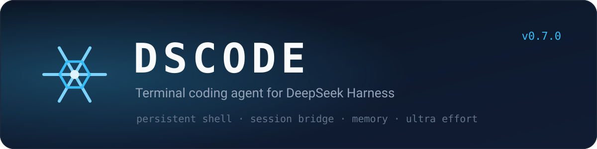
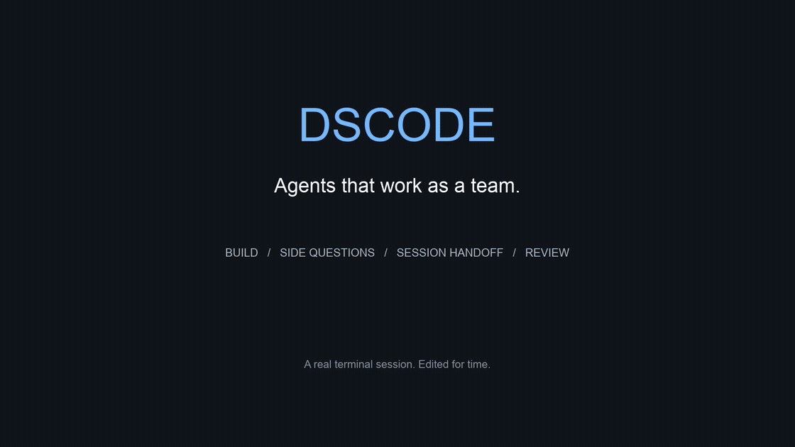

<div align="center">



# ❄ DSCODE

**在终端里写代码，让脚本接入当前会话，让 agent 之间交接任务。**




[](https://www.npmjs.com/package/@toddzheng024/dscode)
[](https://github.com/qiz029/dscode/releases)
[](https://github.com/qiz029/dscode/stargazers)
[](https://github.com/qiz029/dscode/discussions)

[English](README.md) · [简体中文](README.zh-CN.md)

[核心能力](#-核心能力) · [最新变化](#-最新变化) · [快速开始](#-快速开始) · [常用命令](#-常用命令) · [更新日志](docs/CHANGELOG.md) · [文档](#-文档)

</div>

DSCODE 是基于 [DeepSeek Harness](https://github.com/deepseek-ai/deepseek-harness) 的 macOS 终端编码 agent。持久 Shell 负责读写代码和执行测试；TUI、CLI 与脚本共用同一个会话运行时，而不是各自启动一套。它以固定版本的可复现 harness 安装——DSH 依赖、TUI 与插件一起打包、一起校验。

多数编码 agent 是单打独斗。DSCODE 建在相反的假设上：同一台机器上的会话**彼此可见**——一个可以把任务交出去，另一个可以审阅 diff，而放行与否由一个独立审核模型按**你的指令**判断，而不是查规则表。

**60 秒看懂**——三件多数编码 agent 做不到的事，以及在哪里看：

| 在一个终端里 | 说明 |
|---|---|
| `/btw 第一轮为什么缓存是冷的？` | 旁支问题在独立、只读的子会话里跑，答案只在面板里出现，不进入主线对话。 |
| `dscode send <会话 id> --steer "review parser.ts 的改动并回复"` | 把活交给同一台机器上的另一个会话；它能读你的 transcript、回复、把结论交回来。 |
| `/permission auto-review` · `/review-usage` | 由独立审核模型按你的指令决定放行，并留下它放行了什么、花了多少的记录。 |

[90 秒演示脚本](docs/demo.md) 里有分镜、确切命令与录制方法。

## 🧭 核心能力

| 能力 | 说明 |
|---|---|
| **[编码循环](docs/dscode-ultra.md)** | 持久 Shell 保留 cwd、环境和后台任务，可读写文件、搜索、应用补丁并运行测试。项目指令、skills、plan、goal 与 hooks 已接入。 |
| **[会话接入](docs/session-bridge.md)** | 在 TUI 开始任务后，可从另一个终端补充要求、读取输出或订阅进展（`dscode sessions`、`send`、`read`、`watch`）。所有来源进入同一个运行时和上下文，读取和订阅不需要取得 session 写锁。 |
| **[Agent 间任务](docs/session-communication.md)** | Agent 通过 `list_sessions`、`read_session`、`send_session` 与 `reply_session` 查找、读取并联系其他会话，投递方式可选 `queue`、`steer` 或 `defer`。持久化邮箱、重试去重和有限预算约束消息丢失、重复处理和互相唤醒。 |
| **[会话名片](docs/session-cards.md)** | 每个 session 展示项目、工作区与最近 5 条用户请求 topic，选协作对象时不必先读它的记录。名片描述用户让它做过什么，不放任务结论。 |
| **[跨会话记忆](docs/memory.md)** | 后台提取可复用经验，检索时一并给出工作区和来源消息。支持按 session 或全局关闭，后台模型用量单独统计。 |
| **[推理强度与子 agent](docs/dscode-ultra.md)** | Ultra 使用模型的 `max` 推理，自行决定调查、委派和验证的范围；低于 Ultra 时也能委派，但只在任务确实需要时才用。父 agent 可为每个子 agent 单独选择 effort，需要编辑的子 agent 可从干净的 `HEAD` 建立隔离 Git worktree。 |
| **[独立审查](docs/tui-commands.md)** | 代码改动通过相关检查后，agent 会把 Git diff（非 Git 工作区则是相对任务开始时快照的改动）交给独立的只读模型审查，先修复具体发现再结束本轮。`/review` 可手动触发，范围可选暂存区、基准分支、单次提交或路径。 |
| **[非交互执行](docs/exec.md)** | `dscode exec "prompt"`，或 `git diff \| dscode exec "review this"`，在脚本和 CI 中跑完整一轮：回复流式输出到 stdout，工具活动和 session id 到 stderr，退出码反映轮次结果，支持 `--json` 与 `--resume`。 |
| **[终端体验](docs/session-metrics.md)** | 六种界面语言、可选中复制、向上滚动历史、verbose 思考与工具调用视图、固定在底部的输入区、子 agent 概览，以及底栏 TPS / context / 费用 / 缓存指标。 |
| **[权限护栏](docs/auto-review.md)** | 默认 `workspace-write` sandbox 与独立模型 Auto 审核，可切回人工审批。Ultra 不增加权限，Computer Use 保留人工授权。 |
| **[Agent 邮件](docs/email.md)** | 所有 session 共用的本地 `[ToAgent]` 收件箱：Enter 把邮件作为用户选择的上下文 steer 进当前会话；配置 Gmail 后 agent 可走同一审批流程发信。 |

## 🆕 最新变化

**0.7.32** — OpenCode Go 改为只用 OpenCode 账号登录：`/opencode login` 显示验证码、打开控制台，并在后台完成登录。登录会自动续期，请求发往控制台为你的组织指定的推理地址。0.7.31 用的控制台 API key 不再读取，请运行一次 `/opencode login`。状态栏显示订阅在 5 小时、每周、每月三档额度中的用量，某档用尽时显示何时恢复。授权页显示的是 OpenCode CLI，因为 DSCODE 借用了它的登录客户端。

**0.7.31** — OpenCode Go 加入 `/provider`：`/provider opencode-go` 保存 OpenCode 控制台发放的 key，提供 Go 的 chat-completions 模型——DeepSeek、GLM、Kimi、MiMo、LongCat、Hy 和 Space Bunny——每个模型的推理强度都按线上网关实测结果提供，请求带上 Go 要求的会话 ID，工具调用之间会回传思考内容。Go 会话的联网搜索和 OpenCode 一样走 Exa，不需要额外的 key。Qwen、MiniMax 以及 Go 上的 Grok、GPT 模型走其他协议，暂未提供。

**0.7.30** — `/delegate <任务>` 让主 agent 成为协调者：先在看板上按优先级和依赖规划任务，把就绪的部分派给隔离 Git worktree 中的子 agent，逐个验证结果，再按依赖顺序把通过的改动合并并暂存（不提交）。`/delegate-dashboard` 用彩色看板展示待分配、进行中、验证中、已完成四列。子 agent 并发上限改为非 Ultra 5 个、Ultra 20 个；欢迎界面的雪花重新绘制。

**0.7.29** — `/account` 用系统浏览器以 DeepSeek 账号给 DeepSeek 路由授权：凭据存在本机，已登录的机器不再需要 `DEEPSEEK_API_KEY`；该命令同时可查看账号身份、充值余额与赠额，并支持退出登录。profile 为此组合了一个回环回调服务，且只在登录进行期间存在路由，`DSCODE_ACCOUNT_LOGIN=0` 可移除它。随之修复两处组合：上游改名让禁用补丁静默失效后，host 层的 workflow 引擎重新被关闭；base 已自带 PTC 运行时，冗余的那行也删掉了。

**0.7.28** — DSH 运行时从 `0.1.5-rc.2` 升到 `0.1.7-alpha.2`，带来重试 shell 上带理由的沙箱提权、持久化图片 offload、MCP 资源工具、子代理权限继承与压缩重试恢复。**复核权限预设由 `auto` 改名为 `auto-review`**，因为 DSH 已把 `auto` 保留给自己的集成：请使用 `/permission auto-review`、`dscode exec --permission auto-review` 与 `permission: auto-review`。Computer Use 的现场激活与原生 helper 不受影响，但恢复会话后需重新加载 `computer-use` skill 才会恢复其执行工具。

**0.7.27** — 修复首次 Hub 安装因 Harness 生成空 `cordis.yml` 而失败的问题。Launcher 携带针对性修复的 Hub CLI；发布验证新增原生锁文件安装、launcher 首次启动及 Hub doctor 检查。

**0.7.26** — Trigger 支持每次新建或复用 session、持久化 cron 和 delay job，以及受监管的脚本事件源；可通过 `/trigger`、CLI 或 agent 工具管理，共用工作区和审批边界。TUI 固定为 DSCODE 模式，切换模型时不支持的 effort 会回到目标默认值。TPS 使用接口返回的 token 数，按 request 次数做指数平滑；运行指标和 skills 在左侧，费用、DeepSeek 余额、峰谷和缓存率靠右，窄屏时整组移到第三行。OpenRouter 内容策略拒绝也会明确说明回合停止的原因。

**0.7.25** — 再次运行安装器不再一律拒绝，而是让 tar 安装保持最新：旧版本交给它自己的 `dscode update`（迁移状态，旧目录保留为 `.dscode-backup-<版本>`），相同或更新则只报告、不做改动，不是安装器创建的路径仍然带着它找到的路径拒绝。安装方式新增 Homebrew——`brew tap qiz029/tap && brew trust qiz029/tap && brew install dscode` 装的是同一个 launcher，且该方式下 `dscode update` 只更新 Hub profile，launcher 由 `brew upgrade dscode` 负责。

**0.7.24** — 事件现在可以无人值守地启动 session：触发器定义放在 `<state>/triggers/` 和 `<workspace>/.dsh/triggers/`，事件只携带数据且必须带 `eventId`，用 `dscode trigger` / `/triggers` 运行和查看，`trigger install` 会写入 launchd LaunchAgent——运行失败目前还没有任何通知。`/goal[20]` 可在命令面板设置或重设目标的轮次上限。OpenRouter 侧，MiMo V2.6（pro、flash、ultraspeed）加入回传思考的模型行列，`/model` 改为精选 28 个模型——五个已调优家族加 Anthropic、OpenAI、Google、xAI 的旗舰线——而不是全部 373 个可调用模型；已在清单外模型上的会话仍可继续运行。

每次发布的完整记录见 **[更新日志](docs/CHANGELOG.md)**，更详细的说明见 [0.7.29 更新说明](docs/releases/0.7.29.md)。

## 🚀 快速开始

需要 **macOS 14+、Node 22.19+（22.x）或 24+、npm、Git 和 Google Chrome**。

```sh
npm install -g @toddzheng024/dscode
cd /path/to/project
dscode
```

其余安装方式安装的是同一套固定版本：

| 方式 | 做法 |
|---|---|
| npm / Hub | 上面的命令；launcher 会从 [DSH Plugin Hub](https://dshpluginhub.ai) 安装固定版本的 profile |
| Homebrew | `brew tap qiz029/tap && brew trust qiz029/tap && brew install dscode`（Homebrew 7 会拒绝未信任的第三方 tap）；该方式装的是同一个 launcher，`dscode update` 只更新 profile，launcher 由 `brew upgrade dscode` 负责 |
| GitHub release，一行命令 | `curl -fsSL https://raw.githubusercontent.com/qiz029/dscode/main/install.sh \| sh` |
| release tar 包 | 从 [Releases](https://github.com/qiz029/dscode/releases) 下载 `dscode-<version>-darwin-arm64.tar.gz`（或 `-darwin-x64`），解包后执行 `sh dscode-install/install.sh` |
| 源码 checkout | `git clone https://github.com/qiz029/dscode.git && cd dscode && npm ci --ignore-scripts && npm run setup` |

一行安装器会解析最新 release、校验 GitHub 为其 tarball 公布的 sha256 摘要，然后执行该 tar 包自带的安装流程；`sh -s -- <版本号>` 可固定精确版本而不跟随最新版。所有方式都需要 Node 和 Git。GitHub release 的两种方式不再需要别的：预构建 tar 包（`dscode-<version>-darwin-arm64.tar.gz` 或 `-darwin-x64`）已经带上锁定版本的 `node_modules`，安装时不需要 npm，也不访问任何 npm registry——公司 registry 代理拦截 npm 时就用它。不带平台后缀的 `dscode-<version>.tar.gz` 是源码 tar 包，用 `npm ci` 安装自己的 lockfile；当前平台没有预构建包时安装器会回退到它，也可用 `DSCODE_INSTALL_SOURCE=1` 显式指定。npm 方式则从 Hub 安装固定版本的 profile。

首次启动会从 [DSH Plugin Hub](https://dshpluginhub.ai) 安装固定版本的完整 preset——无需手动拼装插件，也不需要全局安装 pnpm。之后输入 `/login`，在隐藏输入框中粘贴 DeepSeek API key：密钥以 `0600` 权限保存在本机 `~/.dscode/credentials.yaml`，不同项目和安装版本共用，不会发送给 agent。已设置的 `DEEPSEEK_API_KEY` 环境变量优先。想使用 OpenRouter，输入 `/provider openrouter`：DSCODE 会提示输入 OpenRouter key（同样保存在本机，或读取 `OPENROUTER_API_KEY`），并把当前会话切到对应的 DeepSeek 模型；`/model` 随后只列出精选清单，而不是整个目录——DeepSeek、GLM、Kimi、Qwen、MiMo 的当前主力型号，加上 Anthropic、OpenAI、Google、xAI 的旗舰线——直接输入即可搜索。前五家经过适配和测试，后四家的旗舰尽力可用。清单外的模型在已有会话里仍可继续运行。`/provider deepseek` 切回，`/login openrouter` 可更换 key。[OpenCode Go](docs/opencode-go.md) 订阅用法相同：`/opencode login` 用 OpenCode 账号登录，之后 `/provider opencode-go` 即可使用 Go 的 DeepSeek、GLM、Kimi、MiMo、LongCat、Hy 和 Space Bunny 模型。用 `/model` 选择模型或配置其他提供方，用 `/effort` 调整推理强度；默认路由是 `deepseek-official/deepseek-flash`。 TUI 启动时会检查 npm 上的新版本，`/update` 可在退出后自动完成整个安装的升级。

**默认英文，界面支持 6 种语言。** `/language` 打开选择器，`/language ja` 可直接切换；也可以直接写「中文」「日本語」「한국어」。支持 English、简体中文、繁體中文、日本語、한국어、Español。选择按机器保存在 `~/.dsh/dsh-code/language.json`，`DSCODE_LANGUAGE=es` 可覆盖单次运行。

```sh
dscode --continue                 # 继续上次会话
dscode --resume SESSION_ID        # 恢复指定会话（仍在该会话创建时的目录中运行）
dscode --cwd /another/project     # 在指定目录工作
dscode trigger list               # 本项目定义的事件触发运行（run|fire|install|log）
dscode doctor                     # 分析近期运行日志和 session trace
dscode --version                  # 输出 DSCODE 版本
```

npm 启动器会核对已安装 bundle 与 Harness 依赖的推荐版本组合；版本不一致时集中显示一次 warning 并继续运行，不会修改依赖，也不会自动降级。默认不挂载任何 MCP server。桌面工具通过 skill 渐进加载，截图理解需要支持图片的模型；MCP bridge 提供 tools，不提供 resources/prompts；Computer Use 的辅助功能和录屏权限需在 macOS 中单独授予。自带的 MCP server（含 Chrome DevTools MCP）在 `config/mcp.local.yml` 中按需添加。

<details>
<summary><b>其他安装方式、升级与回退</b></summary>

**从源码运行**

```sh
git clone https://github.com/qiz029/dscode.git
cd dscode
npm ci --ignore-scripts
npm run setup
npm start

# 操作另一个项目
npm start -- --cwd /path/to/project
```

也可复制 `.env.example` 为 `.env`，仅在本机填写密钥；此方式会优先于 `/login` 保存的凭据。

**一行安装** —— 安装器直接来自仓库并自行获取 release；在 `--` 之后给出精确版本号即可固定版本，而不是跟随最新版：

```sh
curl -fsSL https://raw.githubusercontent.com/qiz029/dscode/main/install.sh | sh
curl -fsSL https://raw.githubusercontent.com/qiz029/dscode/main/install.sh | sh -s -- 0.7.29
```

**tar 包安装** —— 从 [GitHub Releases](https://github.com/qiz029/dscode/releases/latest) 下载预构建的 `dscode-<version>-darwin-arm64.tar.gz`（Apple 芯片）或 `dscode-<version>-darwin-x64.tar.gz`（Intel），然后执行：

```sh
mkdir dscode-install
tar -xzf dscode-<version>-darwin-arm64.tar.gz -C dscode-install
sh dscode-install/install.sh
```

默认命令位于 `~/.local/bin/dscode`，请确保该目录在 PATH 中。再次运行可让 tar 安装保持最新：旧版本交给它自己的 `dscode update` 原地升级，版本相同或更新则只报告、不做改动；其他情况——不是 DSCODE 安装的目录，或属于另一个安装的 `dscode` 命令——会带着它找到的路径拒绝执行。

**若 npm 包名查询暂时返回 404**，可直接安装同一版本的官方 registry tarball：

```sh
npm install -g https://registry.npmjs.org/@toddzheng024/dscode/-/dscode-0.7.29.tgz
```

**升级** —— `dscode update [精确版本号]` 一步完成整个安装的更新，且要求没有正在运行的 DSCODE 会话。npm/Hub 安装会先用 npm 替换 launcher 本体，再把已安装的 profile 升到同一版本；tar 安装会下载 release tar 包（release 带有当前平台的预构建包时取它，升级同样不需要 npm）、按发布方 sha256 校验、原位换目录并迁移 `.runtime`、`.env` 和本地 `config/`，旧安装保留为同级备份目录。源码检出同样一条命令更新：先对它跟踪的分支执行 `git pull --ff-only`，再跑 `npm ci --ignore-scripts` 和 `npm run setup`；工作区中有未提交的改动时会先拒绝，避免更新只做一半。

```sh
dscode update                  # 最新版本
dscode update 0.7.29           # 指定版本
```

`dscode history` 查看保留的版本记录，`dscode rollback` 回到上个 preset 版本（npm/Hub 安装）。带 `dscode update` 之前的旧 tar 安装，请把新 tar 包装到新目录并手动迁移一次状态。源码、tar 与 npm/Hub 使用不同的数据目录，会话和凭据不会互相迁移。详见 [tar 分发说明](docs/distribution.md) 与 [npm + Hub 分发指南](docs/hub-distribution.md)。

</details>

## ⌨️ 常用命令

| 命令 | 作用 |
|---|---|
| `/login` | 在隐藏输入框粘贴 DeepSeek API key，保存到 `~/.dscode/`，启动自动加载 |
| `/account` | 用浏览器登录 DeepSeek 账号代替粘贴 key，并查看身份、余额与退出登录 |
| `/model`、`/effort` | 选择模型（直接输入即可搜索）、配置其他凭据；支持四档的模型用横向 bar 调整 effort |
| `/new` | 新建会话；TUI 固定使用 `dscode` preset，恢复旧会话时也使用该 preset |
| `/status`、`/doctor` | 会话状态与运行时诊断 |
| `/memories` | 全局记忆状态、后台用量、开关与清理 |
| `/session` | 当前 session ID、名片与外部接入入口 |
| `/permission auto-review`、`/permission ask` | 切换自动审核或人工审批 |
| `/review-usage` | 查看自动审核的额外 token 与耗时 |
| `/shell`、`/shell reset` | 检查或重置持久终端 |
| `/mcp`、`/skills`、`/hooks` | 管理 MCP、检查 skill 来源、查看或重载 hooks |
| `/plan`、`/goal` | 计划与持续任务 |
| `/agents` | 查看子 agent 的任务、状态与当前活动 |
| `/delegate <任务>` | 主 agent 先把任务拆到看板上并标明优先级和依赖，在子 agent 有空位时按优先级把依赖已满足的任务派给隔离 Git worktree 中的子 agent，解答它们的提问、逐个验证结果，最后把决定合并的改动暂存到主工作区 |
| `/delegate-dashboard` | 弹出委派任务看板：待分配、进行中、验证中、已完成 |
| `/mailbox` | 查看 session 消息和 deferred 便签 |
| `/email` | `i` 配置 IMAP 邮箱与应用密码；浏览 `[ToAgent]` 邮件，Enter 直接 steer 进当前 session |
| `/compact` | 压缩历史上下文 |
| `/diff`、`/review` | 查看代码修改；`/review` 用独立、只读模型请求审查 Git diff |
| `/clear` | 开始新的空上下文会话，旧会话仍可恢复 |
| `/resume`、`/fork` | 恢复或分叉会话 |

`Shift+Enter` 换行，`!命令` 运行本地 Shell 命令，`Ctrl+L` 只清屏，`Esc` 中断当前操作。完整命令以 TUI `/help` 为准，[命令与 hooks 说明](docs/tui-commands.md) 覆盖其余部分。

## 🔧 权限与配置

默认使用 `workspace-write` sandbox 和 **Auto** 权限审核，适用的审批请求交给独立模型；`/permission ask` 切回人工审批。Ultra 不增加权限。[Auto 的范围、成本与限制 →](docs/auto-review.md)

| 安装方式 | 会话、凭据与统计 | 本地配置 |
|---|---|---|
| npm / Hub | `~/.local/share/dscode-hub`，可用 `DSCODE_HOME` 覆盖 | 数据目录的 `.env` 和 `config/` |
| 源码 | 仓库 `.runtime/` | 仓库 `.env` 和 `config/` |
| tar | 安装目录 `.runtime/` | 安装目录 `.env` 和 `config/` |

支持 `config/hooks.local.json`、`config/mcp.local.yml` 和 `config/harness.local.yml`；这些本地配置、密钥与会话不会打入发布包。Skills 会发现目标项目的 `.agents/skills`、`.dsh/skills`，以及隔离的用户 skill 目录；用 `/skills conflicts` 排查同名覆盖。默认会把项目的 `.codex/hooks.json`、`.dsh/hooks.json`、`.claude/settings.json` 叠加到 `config/hooks.local.json` 之上；设置 `DSCODE_PROJECT_HOOKS=0` 可只加载安装级配置。Skills 来自项目的 `.dsh/skills`、`.agents/skills` 与用户根；默认还会发现当前目录到 home 之间每一层的 `.dsh/skills`、`.agents/skills`、`.claude/skills`，同名以更近的目录为准；设置 `DSCODE_SKILL_ANCESTORS=0` 可只保留项目与用户根。这些祖先目录里的 `AGENTS.md`/`CLAUDE.md` 会并入工作区指令。

## 🧩 开发与发布

```sh
npm test                    # 单元与契约测试（隔离上游依赖）
npm run check               # 覆盖率、集成、TUI 与打包检查
npm run doctor              # 本地确定性 agent 集成检查
npm run build:packages      # 构建 launcher 与完整 bundle 的 npm tgz
npm run release:hub         # 构建 Hub release 和 .dshprofile
npm run verify:hub          # 临时安装、agent 检查、失败升级与回退
npm run dist                # 构建备用 tar 安装包
```

`make release` 按同样顺序执行整个 build job——版本校验、`npm run check`、三个构建步骤、`verify:hub`，最后打包 `release-candidates.tar.gz`；`make publish` 按顺序执行 publish job 的各阶段。`make help` 列出全部 target；workflow 本身不调用 make。

| 分发组件 | 内容 |
|---|---|
| `@toddzheng024/dscode` | `dscode` 命令、首次安装引导与 Hub 版本管理 |
| `@toddzheng024/dscode-bundle` | 基础层、Computer Use、自定义插件与修改后的 TUI/runtime |
| Hub profile `dscode` | 固定 bundle/runtime 版本与完整性哈希 |

Bundle 在构建阶段生成修改后的模块，不在使用者机器上改第三方源码。DSH 依赖统一固定到 `0.1.7-alpha.2`；TUI 基于 `dsh-code@1.2.0`，Computer Use 为 `0.3.2`。完整流程——先发布 bundle，再上线 Hub release，最后发布 launcher——见 [分发指南](docs/hub-distribution.md)。上下文压缩评测位于 [`eval/`](eval/README.md)，用 `npm run eval:compaction` 运行。

## 📚 文档

| 文档 | 内容 |
|---|---|
| [更新日志](docs/CHANGELOG.md) | 每次发布，最新在前 |
| [非交互执行](docs/exec.md) | `dscode exec`、JSON 输出、resume 与 effort/model/permission 参数 |
| [触发器](docs/triggers.md) | 由事件触发运行，可新建或复用会话：cron、延迟任务、托管脚本循环、`/trigger` TUI 管理、agent 工具、运行日志 |
| [会话接入](docs/session-bridge.md) | 用 `dscode sessions`、`send`、`read`、`watch` 接入运行中的会话 |
| [Session 通信](docs/session-communication.md) | Agent 侧消息、投递方式、预算与去重 |
| [会话名片](docs/session-cards.md) | 项目、工作区与 topic 字段及其来源 |
| [记忆](docs/memory.md) | 全局跨 session 记忆、后台用量与开关 |
| [持久 Shell 与 Ultra](docs/dscode-ultra.md) | preset、推理强度、子 agent effort 与 worktree 隔离 |
| [账号登录](docs/account-login.md) | 用浏览器账号代替 API key 给 DeepSeek 路由授权：流程、回环回调与限制 |
| [OpenCode Go](docs/opencode-go.md) | 用 OpenCode Go 订阅运行会话：账号登录、状态栏用量、模型及其推理强度、暂不支持的部分 |
| [Auto 审核](docs/auto-review.md) | 独立权限审核的范围、成本与限制 |
| [邮件](docs/email.md) | IMAP 配置、收件箱面板、`send_email` 与联系人别名 |
| [Skills 与工作区指令](docs/skills.md) | 发现范围、祖先模式与指令文件 |
| [TUI 命令](docs/tui-commands.md) | 命令参考与 hooks |
| [Session 指标](docs/session-metrics.md) | 底栏 TPS、context、费用与缓存的统计口径 |
| [演示脚本](docs/demo.md) | 90 秒演示：分镜、确切命令与录制方法 |
| [npm + Hub 分发](docs/hub-distribution.md) | bundle、Hub release 与 launcher 流程 |
| [tar 分发](docs/distribution.md) | 独立 tar 安装器 |
| [验证说明](docs/verification.md) | 维护中的检查覆盖范围 |

设计记录不重复上面这些指南：

| 文档 | 内容 |
|---|---|
| [Session 通信设计](docs/session-messaging-design.md) | Agent 间任务的取舍、边界与固定限制的依据 |
| [云端 Web App Host](docs/cloud-webapp-host.md) | 浏览器接入的架构基线与信任模型；尚未实现 |
| [触发器](docs/triggers-design.md) | 触发器机制为何如此设计：投递入口、持久化任务与调度器、运行日志作为契约 |
| [验证说明](docs/verification.md) | 维护中的检查覆盖范围，以及哪些检查不能在 session 内运行 |
| [可维护性](docs/maintainability.md) | 对 vendored 终端的检查范围，以及仍未验证的部分 |
| [升级 vendored 终端](docs/vendored-tui-upgrade.md) | 合并上游 dsh-code 新版本的流程，以及只有人工冒烟测试能发现的部分 |
| [版本说明](docs/releases/) | 每个版本的长文说明，最新在前 |
| [上下文交接](docs/CONTEXT-HANDOFF.md) | 供新 session 接手的开发备忘，不是用户文档 |

## 🤝 参与

欢迎提 issue 和 pull request。改动请先跑 `npm run check`，并保持发布流程不变：先 bundle，再 Hub release，最后 launcher。

## 📄 许可

[MIT](LICENSE) © 2026 Todd Zheng

---

基于 [DeepSeek Harness](https://github.com/deepseek-ai/deepseek-harness)、[DSH-Code](https://github.com/unlinearity/dsh-code) 与 [DSH Plugin Hub](https://dshpluginhub.ai)。独立社区项目，非 DeepSeek 官方产品。
